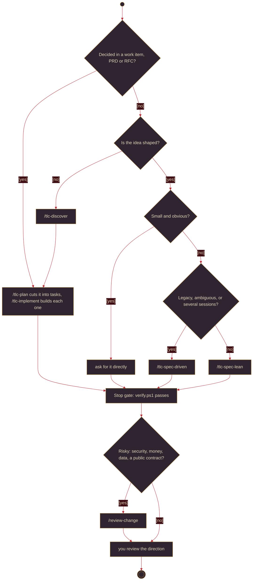
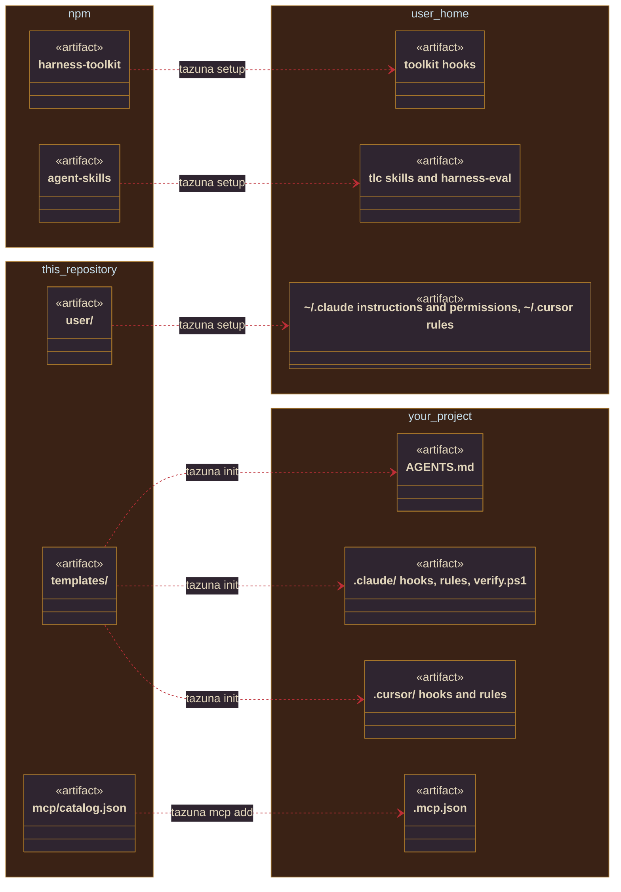
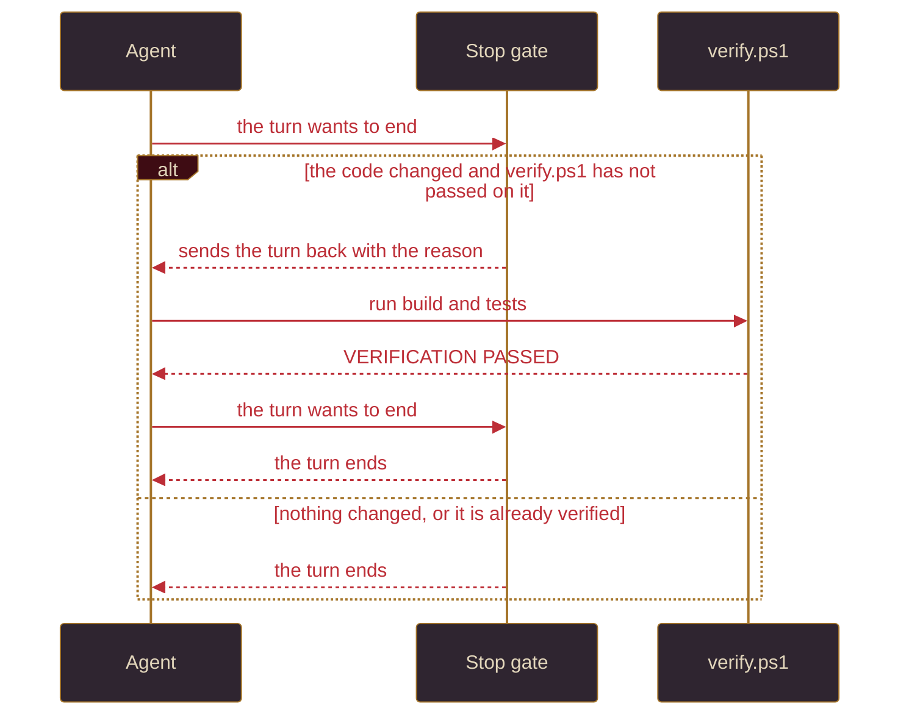

<div align="center">



<h1>Tazuna</h1>

[](CHANGELOG.md)
[](#prerequisites)
[](#prerequisites)
[](LICENSE)

*No turn ends on untested code. The seal lights only for what was proven.*

A verification gate for Claude Code and Cursor that works in any stack, with the Tech Leads Club workflow ready to use on Windows. One command sets up the machine and another sets up each project.

[Getting started](#getting-started) · [Usage](#usage) · [Report a problem](https://github.com/AlfredoNeeto/tazuna/issues)

</div>

<details>
<summary>Table of contents</summary>

1. [About the project](#about-the-project)
2. [Getting started](#getting-started)
3. [Usage](#usage)
4. [How it works](#how-it-works)
5. [Safety](#safety)
6. [Troubleshooting](#troubleshooting)
7. [Contributing](#contributing)
8. [License](#license)
9. [Acknowledgments](#acknowledgments)

</details>

## About the project

> *No work is finished because its author says so.*

A coding agent often ends its turn with "done" on code that nobody ran, and adding rules to the prompt does not change that. What helps is a small context, room to implement, and proof from someone who did not write the code. Tazuna sets that up for Claude Code or Cursor, whichever you use, and enforces one step itself: a turn that changed code cannot end until the agent has run the project's own build and tests.

Tazuna (手綱) means reins, the part of a horse's harness the rider holds. Writing on agents describes *Agent = Model + Harness*, where the harness combines guides, which steer the agent before it acts (`AGENTS.md`, rules, skills, permissions), and sensors, which check the result afterwards (`verify.ps1`, the Verifier, `/review-change`). Reins do both: they steer the horse and let the rider feel it, and the horse still supplies the strength.

Tazuna itself is small. It installs the Tech Leads Club's `tlc-*` skills and `harness-toolkit`, adds its own verification gate and `/review-change`, and leaves everything else to your repository.

## Getting started

> *Before the vigil, the vessel is prepared.*

### Prerequisites

| You need | For | If it is missing |
|---|---|---|
| Windows PowerShell 5.1 | everything | it ships with Windows |
| Git | cloning and updating | `setup` stops and says so |
| Node.js 24+ | the toolkit, the skills, the MCP servers | `setup` stops and prints `winget install OpenJS.NodeJS.LTS` |
| Claude Code 2.1.277+, or Cursor | the agent; either one is enough. With Cursor, open it once before `setup` ([docs/cursor.md](docs/cursor.md)) | `setup` stops when neither is installed |
| `python3` | the validators of the `tlc-*` skills | a warning; the skills check the artifacts by reading them |

### Installation

Run this in your own terminal, outside Claude Code and Cursor:

```powershell
git clone https://github.com/AlfredoNeeto/tazuna.git "$HOME\tazuna"; & "$HOME\tazuna\bin\tazuna.cmd" setup
```

`setup` adds `tazuna` to your user PATH. To use it in the same shell, run the line it prints:

```powershell
$env:Path += ";$HOME\tazuna\bin"
```

`setup` installs `harness-toolkit` 0.16.2 and runs `tlc harness install`, installs the `tlc-*` and `harness-eval` skills and the user MCP servers, then runs `tazuna doctor`. Running it again repairs a machine that drifted. For Claude Code it also copies `user/` into `~/.claude` and adds the `ponytail` plugin. It replaces `~/.claude/settings.json` and `~/.claude/CLAUDE.md` with Tazuna's and keeps a backup of yours in `~/.claude\.harness-backup\`; those settings switch off the claude.ai connectors and sync (`disableClaudeAiConnectors`). For Cursor it puts the skills, the instructions as a rule, the toolkit hooks and the servers under `~/.cursor`, and with both installed it equips both. Run `setup` and `update` outside the agent, and call `bin\tazuna.cmd` rather than the `.ps1`, which an `AllSigned` execution policy blocks.

### Your first project

```powershell
cd C:\src\MyApi
tazuna init
```

`init` detects the stack (`dotnet` or `generic`) and writes `AGENTS.md` plus `.claude\` with the permissions, the three hooks, stack rules and `scripts\verify.ps1`, the project's build and tests. Cursor reads those files too, and `init` adds `.cursor/hooks.json` and the stack rules as `.cursor/rules/*.mdc` for it. It also trusts the workspace, since Claude Code silently ignores project hooks otherwise, and never overwrites a file you edited unless you pass `-Force`. In `AGENTS.md`, write only what the code does not show, because every line there goes into every turn.

<p align="center"></p>

## Usage

> *Every work is weighed. None leaves the forge untested.*

### The loop

```mermaid
stateDiagram-v2
    direction LR
    [*] --> Discovery
    Discovery --> Plan
    Plan --> Checks: you approve
    Checks --> Build
    Build --> Verify
    Verify --> Build: a check fails
    state "Code review" as Review
    state "Human review" as Human
    Verify --> Review: every check passes
    Review --> Human
    Human --> [*]
    classDef optional fill:#2f2530,stroke:#a5752a,color:#e2d6bb,stroke-dasharray: 5 5
    classDef enforced fill:#7f1721,stroke:#d9a948,color:#e2d6bb,stroke-width: 3px
    classDef rite fill:#2f2530,stroke:#a5752a,color:#e2d6bb
    class Discovery,Plan,Checks,Review optional
    class Verify enforced
    class Build,Human rite
```



`Verify` is enforced: the `Stop` gate requires a passing `verify.ps1` on every change, in every project, and rejects a Verifier report that fails its validator. The dashed steps depend on the workflow you choose.

### Choosing a workflow



| Size of the change | What to use |
|---|---|
| An idea not shaped yet | `/tlc-discover` |
| A feature | `/tlc-spec-lean` |
| Legacy code, ambiguous requirements, several sessions | `/tlc-spec-driven` |
| Work already decided in a work item, PRD or RFC | `/tlc-plan` to cut it into tasks, `/tlc-implement` to build each one |
| Risky: security, money, data, a public contract | `/review-change`, even when the change is small |

With `/tlc-spec-lean I want X`, the agent reads the code, asks you only about decisions that are yours, writes `.specs/features/<feature>/plan.md` and stops until you approve it. Each criterion becomes a check with the test that settles it. The agent builds, and a fresh Verifier that never saw the implementation proves every check. A changed screen is opened with Playwright before it is done.

### Adding an MCP server

`tazuna mcp list` shows the catalog and `tazuna mcp add <name>` adds a server to the project you are in:

| Name | For |
|---|---|
| `azure-devops` | pull requests, work items, wiki and search on an on-premises Azure DevOps Server; asks for the project URL and a token, checks them, and keeps them for that project only |
| `serena` | symbol navigation: callers, implementations, declarations; needs `uvx` |
| `drawio` | editing diagrams in draw.io |
| `plantuml` | rendering PlantUML; the diagram text goes to `PLANTUML_SERVER_URL`, the public `plantuml.com` if unset |
| `mermaid` | rendering Mermaid locally |

The command merges the entry into the project's `.mcp.json` and enables it, with credentials only as `${VARIABLE}` placeholders; restart Claude Code and approve the server. `.mcp.json` belongs to Claude Code, so in Cursor add the server to `.cursor/mcp.json` by hand. See [docs/mcp.md](docs/mcp.md).

### Commands

| Command | What it does |
|---|---|
| `tazuna setup` | installs or repairs the machine, then runs `doctor` |
| `tazuna init` | sets up the project you are in |
| `tazuna mcp` | `mcp list` shows the catalog; `mcp add <name>` adds a server to the project |
| `tazuna doctor` | checks the toolchain, the toolkit hooks, the skills and drift from this repository |
| `tazuna update` | fast-forwards this repository and runs `setup` again |
| `tazuna test` | runs this repository's self-test |
| `tazuna help <command>` | shows a command's options and examples; `tazuna <command> --help` does the same |
| `tazuna version` | shows the installed version; `--version` and `-v` work too |

`setup`, `init`, `mcp` and `update` accept `-WhatIf`, and a mistyped name gets the closest suggestion. `TAZUNA_PLAIN=1` forces ASCII output and `NO_COLOR` removes colour.

<p align="center"></p>

## How it works

> *The seal lights only for what was proven.*



What holds for every session lives in your user directory, `~/.claude` or `~/.cursor`; what belongs to the team lives in the project, in version control.



The gate compares a fingerprint of the code with the last passing run, blocks once per turn, and fails open without a `verify.ps1` or on its own error. A run with `-SkipTests` does not count. Claude Code receives the reason through the `Stop` hook's exit code 2; Cursor receives it as a follow-up message from its `stop` hook.

## Safety

> *What is sacred is guarded, not trusted.*

| Protection | Enforced by |
|---|---|
| No turn ends on unverified code | the `Stop` hook (`stop` in Cursor), per project, in any stack |
| No secret gets into a commit | the `PreToolUse` hook (`beforeShellExecution` in Cursor), which inspects what is staged |
| Nothing is published or destroyed without you: `git push`, `reset --hard`, `clean`, `gh pr create`, `terraform apply` are denied, `commit` asks | permissions in `~/.claude/settings.json`; Cursor has no permission rules, so there only the toolkit floor below applies |
| Secrets stay out of the context: `.env`, `*.pem` and `~/.ssh` are unreadable, secret-looking output is masked | Claude Code permissions and `harness-toolkit` |
| Nothing is destroyed outside the repository, and `push --force` is denied | the `harness-toolkit` floor, which in 0.16.2 sees only Bash tool commands; for PowerShell the `deny` rules hold |
| No feature is done without independent proof | the Verifier and `validate_verification.py` |

## Troubleshooting

> *Confess the symptom; the remedy follows.*

| Symptom | What to do |
|---|---|
| `tazuna` is not recognised | open a new shell, or run `& "$HOME\tazuna\bin\tazuna.cmd" setup` |
| `doctor`: `no tlc-exec hook` or `skill ... is missing` | run `tazuna setup` in your terminal |
| The turn does not end: "The code changed since the last passing verification" | that is the gate: run `.\.claude\scripts\verify.ps1` and fix what fails |
| The toolkit denied something | `tlc harness why` shows the latest decisions and their rules |
| `doctor`: `installed but not in the repository` | a skill or agent you added yourself; it stays active, and `setup` never removes it |
| You want the toolkit's `harness-init` skill | it is hidden on purpose because it gitignores the project settings; use `tazuna init` |
| `.tlc/` shows up as untracked | `tazuna init` adds `**/.tlc/harness/state/` to `.gitignore` |
| Everything looks wrong in Claude Code | `claude --safe-mode` starts it without any customisation |

<p align="center"></p>

## Contributing

> *The order welcomes every pilgrim who brings proof.*

Issues and pull requests are welcome. The rules are in [AGENTS.md](AGENTS.md): after any change `tazuna test` has to print `VERIFICATION PASSED`, and the target is Windows PowerShell 5.1. Changes are listed in [CHANGELOG.md](CHANGELOG.md).

## License

> *Each relic keeps the covenant it was given.*

Tazuna's own code is released under the MIT License, see [LICENSE](LICENSE). What it installs keeps its own licence:

| Piece | Licence |
|---|---|
| `harness-toolkit` | Elastic License 2.0: free to use and modify, not to offer as a hosted service; not OSI open source |
| `agent-skills` (the `tlc-*` and `harness-eval` skills) | CC-BY-4.0, with attribution to the Tech Leads Club |
| `humanizer` skill by Siqi Chen | MIT, in [user/skills/humanizer/LICENSE](user/skills/humanizer/LICENSE) |
| `ponytail` plugin by [DietrichGebert](https://github.com/DietrichGebert/ponytail) | its own licence, in that repository; installed from its marketplace, not copied here |

## Acknowledgments

> *Honour to those who forged the reins.*

- The workflow, the skills and the toolkit come from the [Tech Leads Club](https://github.com/tech-leads-club).
- The ideas behind the loop come from Waldemar Neto's video, [https://www.youtube.com/watch?v=yKLedmyUDMA](https://www.youtube.com/watch?v=yKLedmyUDMA).
- `humanizer` 3.0.0 comes from [akitaonrails/my-skills](https://github.com/akitaonrails/my-skills/tree/master/humanizer).
- Frenatus is the original mascot of Tazuna, drawn for this repository in tenebrist pixel art ([docs/mascot.md](docs/mascot.md)); the layout follows [Best-README-Template](https://github.com/othneildrew/Best-README-Template).

<p align="center"><br><br><sub>Plan, Checks, Build, Verify, Review. The model reads everything else from your repository.</sub></p>
