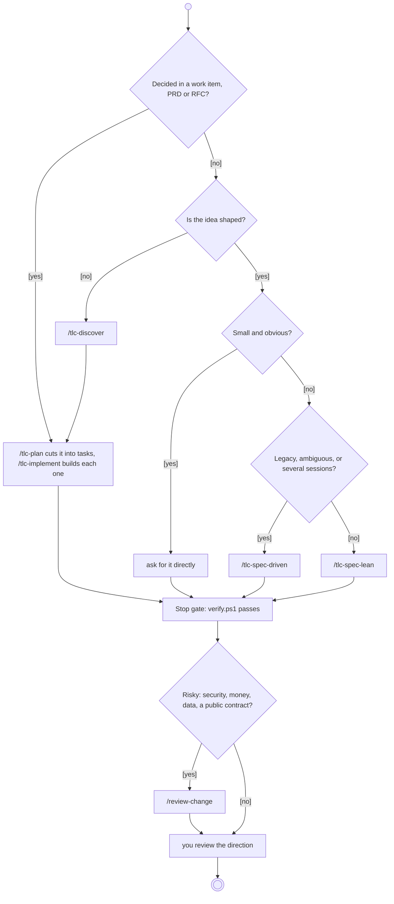
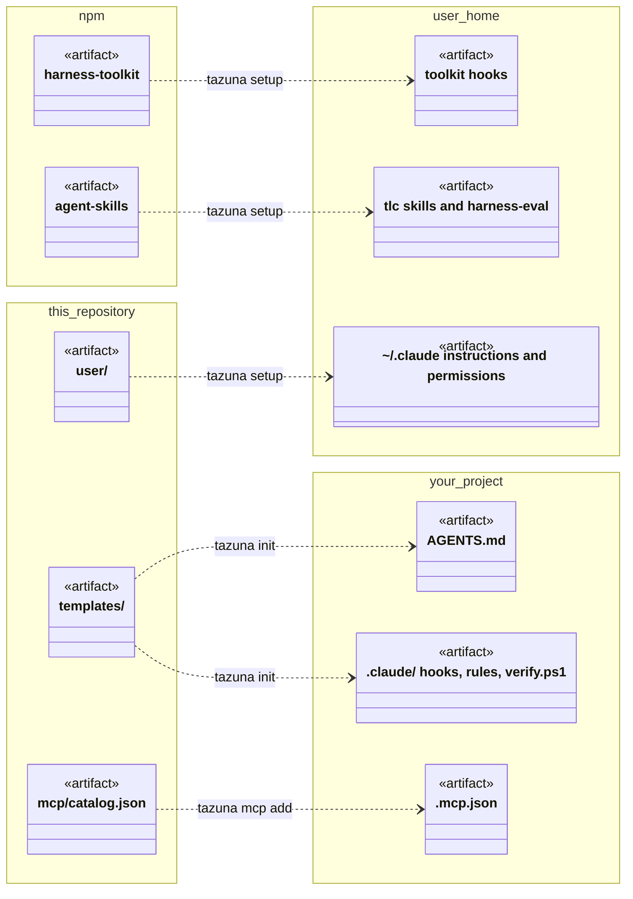
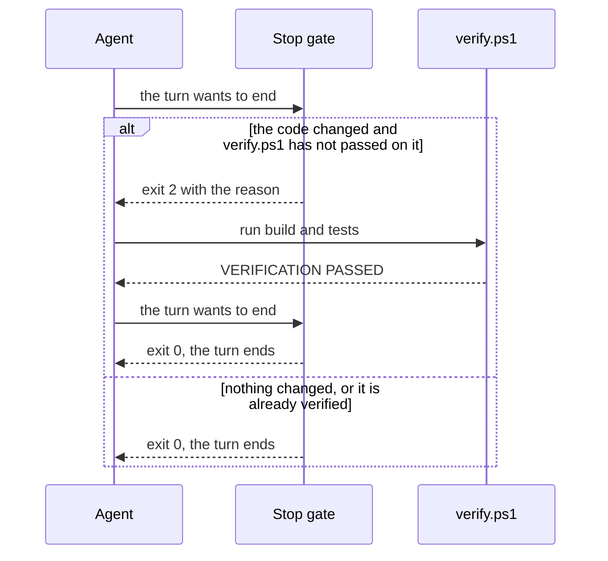

<div align="center">


<h1>Tazuna</h1>

[](CHANGELOG.md)
[](https://docs.claude.com/en/docs/claude-code/overview)
[](#prerequisites)
[](LICENSE)

A verification gate for Claude Code that works in any stack, with the Tech Leads Club workflow
ready to use on Windows. One command sets up the machine, one command sets up a project.

[Getting started](#getting-started) · [Usage](#usage) · [Report a problem](https://github.com/AlfredoNeeto/tazuna/issues)

</div>

<details>
<summary>Table of contents</summary>

1. [About the project](#about-the-project)
2. [Getting started](#getting-started)
3. [Usage](#usage)
4. [How it works](#how-it-works)
5. [Safety](#safety)
6. [Troubleshooting](#troubleshooting)
7. [Contributing](#contributing)
8. [License](#license)
9. [Acknowledgments](#acknowledgments)

</details>

## About the project

A coding agent tends to end its turn with "done" on code that nobody ran. More rules in the
prompt do not fix that. What fixes it is little context, room to implement, and proof that the
result is right, checked by someone who did not write it. Tazuna sets that up for Claude Code and
enforces the step that matters most: a turn that changed code cannot end quietly, because the
agent is sent back to run the project's own build and tests first.

Tazuna (手綱) means reins, the part of a horse's harness the rider holds. In the writing on
agents, *Agent = Model + Harness*, and a harness combines guides, which steer the agent before it
acts (`AGENTS.md`, rules, skills, permissions), with sensors, which check the result afterwards
(`verify.ps1`, the Verifier, `/review-change`). Reins do both: they steer the horse and let the
rider feel it. The strength is still the horse's.

Tazuna itself is small: it installs the Tech Leads Club's `tlc-*` skills and `harness-toolkit`,
adds its own verification gate and `/review-change`, and leaves everything else to your repository.

## Getting started

### Prerequisites

| You need | For | If it is missing |
|---|---|---|
| Windows PowerShell 5.1 | everything | it ships with Windows |
| Git | cloning and updating | `setup` stops and says so |
| Node.js 24+ | the toolkit, the skills, the MCP servers | `setup` stops and prints `winget install OpenJS.NodeJS.LTS` |
| Claude Code 2.1.277+ | `AGENTS.md` in projects | `doctor` fails |
| `python3` | the validators of the `tlc-*` skills | a warning; the skills check the artifacts by reading them |

### Installation

Run this in your own terminal, outside Claude Code:

```powershell
git clone https://github.com/AlfredoNeeto/tazuna.git "$HOME\tazuna"; & "$HOME\tazuna\bin\tazuna.cmd" setup
```

`setup` adds `tazuna` to your user PATH. To use it in the same shell, run the line it prints:

```powershell
$env:Path += ";$HOME\tazuna\bin"
```

`setup` copies `user/` into `~/.claude`, installs `harness-toolkit` 0.16.2 and runs
`tlc harness install`, installs the `tlc-*` and `harness-eval` skills, the `ponytail` plugin and
the user MCP servers, then runs `tazuna doctor`. Running it again repairs a machine that drifted.
It replaces `~/.claude/settings.json` and `~/.claude/CLAUDE.md` with Tazuna's and keeps a backup of
yours in `~/.claude\.harness-backup\`; those settings also switch off the claude.ai connectors and
sync (`disableClaudeAiConnectors`). Run `setup` and `update` outside Claude Code, and call
`bin\tazuna.cmd` rather than the `.ps1`, which an `AllSigned` execution policy blocks.

### Your first project

```powershell
cd C:\src\MyApi
tazuna init
```

`init` detects the stack (`dotnet` or `generic`) and writes `AGENTS.md` plus `.claude\` with the
permissions, the three hooks, stack rules and `scripts\verify.ps1`, the project's build and tests.
It also trusts the workspace, since Claude Code silently ignores project hooks otherwise, and it
never overwrites a file you edited unless you pass `-Force`. In `AGENTS.md`, write only what the
code does not show; every line there goes into every turn.

## Usage

### The loop

```mermaid
stateDiagram-v2
    direction LR
    [*] --> Discovery
    Discovery --> Plan
    Plan --> Checks: you approve
    Checks --> Build
    Build --> Verify
    Verify --> Build: a check fails
    state "Code review" as Review
    state "Human review" as Human
    Verify --> Review: every check passes
    Review --> Human
    Human --> [*]
    classDef optional stroke-dasharray: 5 5
    classDef enforced stroke-width: 3px
    class Discovery,Plan,Checks,Review optional
    class Verify enforced
```



`Verify` is enforced: the `Stop` gate requires a passing `verify.ps1` on every change, in every project, and rejects a Verifier report that fails its validator. The dashed steps depend on the workflow you choose.

### Choosing a workflow



| Size of the change | What to use |
|---|---|
| An idea not shaped yet | `/tlc-discover` |
| A feature | `/tlc-spec-lean` |
| Legacy code, ambiguous requirements, several sessions | `/tlc-spec-driven` |
| Work already decided in a work item, PRD or RFC | `/tlc-plan` to cut it into tasks, `/tlc-implement` to build each one |
| Risky: security, money, data, a public contract | `/review-change`, even when the change is small |

With `/tlc-spec-lean I want X`, the agent reads the code, asks only what is your decision, writes
`.specs/features/<feature>/plan.md` and stops until you approve it. Each criterion becomes a check
with the test that settles it; the agent builds, and a fresh Verifier that never saw the
implementation proves every check. A changed screen is opened with Playwright before it is done.

### Adding an MCP server

`tazuna mcp list` shows the catalog and `tazuna mcp add <name>` adds a server to the project you are in:

| Name | For |
|---|---|
| `azure-devops` | pull requests, work items, wiki and search on an on-premises Azure DevOps Server; asks for the collection URL and a token once and stores them as user environment variables |
| `serena` | symbol navigation: callers, implementations, declarations; needs `uvx` |
| `drawio` | editing diagrams in draw.io |
| `plantuml` | rendering PlantUML; the diagram text goes to `PLANTUML_SERVER_URL`, the public `plantuml.com` if unset |
| `mermaid` | rendering Mermaid locally |

The command merges the entry into the project's `.mcp.json` and enables it, with credentials only
as `${VARIABLE}` placeholders. Restart Claude Code and approve the server. See [docs/mcp.md](docs/mcp.md).

### Commands

| Command | What it does |
|---|---|
| `tazuna setup` | installs or repairs the machine, then runs `doctor` |
| `tazuna init` | sets up the project you are in |
| `tazuna mcp` | `mcp list` shows the catalog; `mcp add <name>` adds a server to the project |
| `tazuna doctor` | checks the toolchain, the toolkit hooks, the skills and drift from this repository |
| `tazuna update` | fast-forwards this repository and runs `setup` again |
| `tazuna test` | runs this repository's self-test |
| `tazuna help <command>` | shows a command's options and examples; `tazuna <command> --help` does the same |
| `tazuna version` | shows the installed version; `--version` and `-v` work too |

`setup`, `init`, `mcp` and `update` accept `-WhatIf`, and a mistyped name gets the closest suggestion. `TAZUNA_PLAIN=1` forces ASCII output and `NO_COLOR` removes colour.

## How it works



What holds for every session lives in `~/.claude`; what belongs to the team lives in the project, in version control.



<p align="center">


</p>

The gate compares a fingerprint of the code with the last passing run, blocks once per turn, and
fails open without a `verify.ps1` or on its own error. A run with `-SkipTests` does not count.

## Safety

| Protection | Enforced by |
|---|---|
| No turn ends on unverified code | the `Stop` hook, per project, in any stack |
| No secret gets into a commit | the `PreToolUse` hook, which inspects what is staged |
| Nothing is published or destroyed without you: `git push`, `reset --hard`, `clean`, `gh pr create`, `terraform apply` are denied, `commit` asks | permissions in `~/.claude/settings.json` |
| Secrets stay out of the context: `.env`, `*.pem` and `~/.ssh` are unreadable, secret-looking output is masked | permissions and `harness-toolkit` |
| Nothing is destroyed outside the repository, and `push --force` is denied | the `harness-toolkit` floor, which in 0.16.2 sees only Bash tool commands; for PowerShell the `deny` rules hold |
| No feature is done without independent proof | the Verifier and `validate_verification.py` |

## Troubleshooting

| Symptom | What to do |
|---|---|
| `tazuna` is not recognised | open a new shell, or run `& "$HOME\tazuna\bin\tazuna.cmd" setup` |
| `doctor`: `no tlc-exec hook` or `skill ... is missing` | run `tazuna setup` in your terminal |
| The turn does not end: "The code changed since the last passing verification" | that is the gate: run `.\.claude\scripts\verify.ps1` and fix what fails |
| The toolkit denied something | `tlc harness why` shows the latest decisions and their rules |
| `doctor`: `installed but not in the repository` | a skill or agent you added yourself; it stays active, and `setup` never removes it |
| You want the toolkit's `harness-init` skill | it is hidden on purpose because it gitignores the project settings; use `tazuna init` |
| `.tlc/` shows up as untracked | `tazuna init` adds `**/.tlc/harness/state/` to `.gitignore` |
| Everything looks wrong | `claude --safe-mode` starts without any customisation |

## Contributing

Issues and pull requests are welcome. The rules are in [AGENTS.md](AGENTS.md): after any change `tazuna test` has to print `VERIFICATION PASSED`, and the target is Windows PowerShell 5.1. Changes are listed in [CHANGELOG.md](CHANGELOG.md).

## License

Tazuna's own code is released under the MIT License, see [LICENSE](LICENSE). What it installs keeps its own licence:

| Piece | Licence |
|---|---|
| `harness-toolkit` | Elastic License 2.0: free to use and modify, not to offer as a hosted service; not OSI open source |
| `agent-skills` (the `tlc-*` and `harness-eval` skills) | CC-BY-4.0, with attribution to the Tech Leads Club |
| `humanizer` skill by Siqi Chen | MIT, in [user/skills/humanizer/LICENSE](user/skills/humanizer/LICENSE) |
| `ponytail` plugin by [DietrichGebert](https://github.com/DietrichGebert/ponytail) | its own licence, in that repository; installed from its marketplace, not copied here |

## Acknowledgments

- The workflow, the skills and the toolkit come from the [Tech Leads Club](https://github.com/tech-leads-club).
- The ideas behind the loop come from Waldemar Neto's video, [https://www.youtube.com/watch?v=yKLedmyUDMA](https://www.youtube.com/watch?v=yKLedmyUDMA).
- `humanizer` 3.0.0 comes from [akitaonrails/my-skills](https://github.com/akitaonrails/my-skills/tree/master/humanizer).
- Tameshi is the original mascot of Tazuna, drawn for this repository ([docs/mascot.md](docs/mascot.md)); the layout follows [Best-README-Template](https://github.com/othneildrew/Best-README-Template).

<div align="center">

<br>
<sub>Plan, Checks, Build, Verify, Review. The rest the model reads from your repository.</sub>

</div>
